# OOP Final Project: Photo Mosaic
Last Updated: 2026.06.04

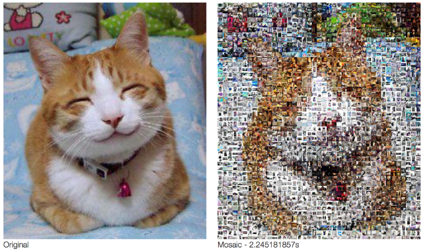  
如你所見，給定一張目標圖片，我們希望可以用很多張小圖拼湊出大圖的原貌。

## 歷屆解說影片
[](https://www.youtube.com/watch?v=GPI-fnaDGTk)

## 誰適合寫這份題目?
*    對學習和探索新知識充滿熱情的人
*    對數位影像處理充滿熱情的人
*    具有上網搜索及自學能力者
*    想要推甄/轉系有作品集的

## 需要/建議具備的能力
*    OOP
*    Dynamic Array
*    Pointer
*    Google Search
*    Gemini/ChatGPT/Claude

## Preface: What is Digital Image?
數位影像是電腦處理的視覺資訊表現形式，與傳統模擬影像不同，它由離散的像素構成，每個像素包含特定的顏色和亮度資訊，而這些像素的排列形成了影像的整體視覺內容。

Ex：8 位元灰階影像
*    位元深度：
        "8 位元" 指的是每個像素的位深度。在 8 位元的灰階影像中，每個像素有 2^8（256）種可能的值，範圍從 0 到 255。
        
*    灰階(有多黑/有多白)：
不同於彩色影像，灰階影像包含各種灰色調。在 8 位元灰階影像中，每個像素代表不同的強度水平，其中 0 為黑色，255 為白色，中間有各種灰色調。[ref link](https://processing.org/tutorials/color)
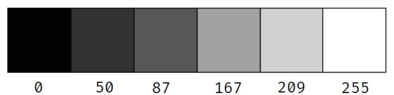
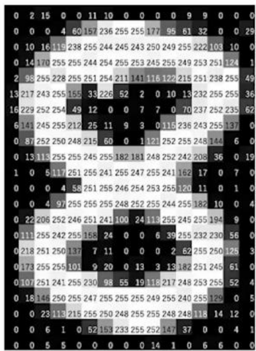

>[!Tip]
>因此，在電腦圖形中表示灰階影像是非常簡單的:使用一個二維陣列，裡面每個數值皆落在 0 到 255 的範圍。若是彩色圖片，則將其二維陣列擴展為有RGB三個channel的三維陣列即可。
>
>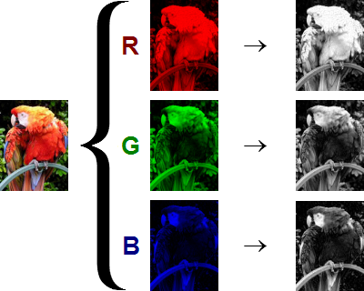

## Step 1: Play around data loader class(15%)
圖片在存成jpg/png是有經過壓縮加密過的，若是學員要直接讀取圖片檔，會有不少問題。因此提供data_loader使學員可以直接得到圖片的像素矩陣及長寬，來進行後續的運算及操作。

以下是data_loader的interface:
```cpp
class Data_Loader{

public:
    Data_Loader();
    ~Data_Loader();
    int **Load_Gray(string filename, int *w, int *h);
    int ***Load_RGB(string filename, int *w, int *h);
    void Dump_Gray(int w, int h, int **pixels, string filename);
    void Dump_RGB(int w, int h, int ***pixels, string filename);
    void Display_Gray_ASCII(int w, int h, int **pixels);
    void Display_RGB_ASCII(int w, int h, int ***pixels);
    void Display_Gray_CMD(string filename);
    void Display_RGB_CMD(string filename);
    bool List_Directory(string directoryPath, vector<string> &filenames);

private:
    bool File_Exists(const string &filename);
};
```

這些interface的usage:
*    Load:
        ```cpp
        int **Load_Gray(string filename, int *w, int *h);
        int ***Load_RGB(string filename, int *w, int *h);
        ```
        給定圖片的路徑，並且設定w與h，最後回傳一個二維(三維)陣列

        >[!CAUTION]
        >Load回傳的dynamic allocate memory需要由學員自己負責刪除，我們會使用valgrind來檢查學員的程式，確保學員對每一個他們new出來的memory負責。

*    Dump:
        ```cpp
        void Dump_Gray(int w, int h, int **pixels, string filename);
        void Dump_RGB(int w, int h, int ***pixels, string filename);
        ```
        給定輸出的w,h,要輸出的二維(三維)陣列與要輸出的圖片檔名，會將圖片輸出成*jpg/*png。

data_loader提供了兩種介面來展示圖片: 
 
*    1. ASCII ART
        使用" .-+#@"來表示圖片中的明暗程度，將圖片以符號的形式印在terminal。
        
        ```cpp
        void Display_Gray_ASCII(int w, int h, int **pixels);
        void Display_RGB_ASCII(int w, int h, int ***pixels);
        ```
        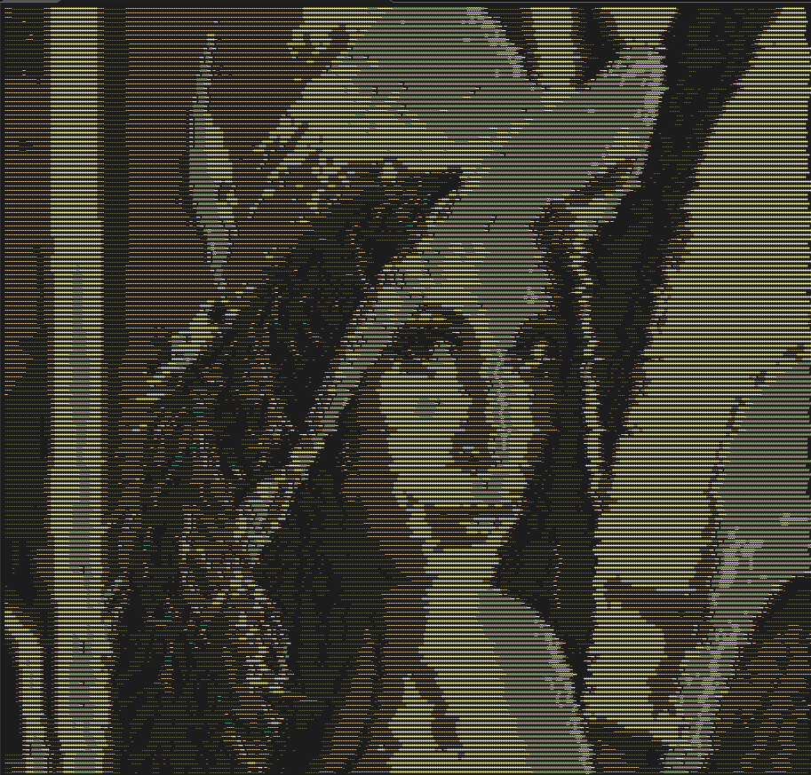

*    2. catimg 
        將圖片本身直接印在terminal，支援灰階及彩色圖片。

        ```cpp
        void Display_Gray_CMD(string filename);
        void Display_RGB_CMD(string filename);
        ```

        

        >[!TIP]
        >該function僅吃已存在的圖片檔的檔名，並把圖片印在terminal，請搭配前面所提到的dump使用。

*    filename iterator

        因為後面會需要學員處理多張照片，這邊提供一個method，來將某資料夾下的所有檔案名稱存進filenames的vector中。

        ```cpp
        bool List_Directory(string directoryPath, vector<string> &filenames);
        ```

## Step 2: Construct image inheritance and polymorphism(15%)

透過base class Image，來讓gray_image及rgb_image繼承，來讓同學練習繼承多型及virtual function。需要將第一步所提及的data_loader與這些class整合。來實現load image/dump image/display image，等基礎功能。

繼承關係如下圖:
>[!TIP]
> 下圖中的  
>`#` 符號 代表 `protected`（在 `Image` 頂部區塊，與底下的函式用實線隔開）  
>`-` 符號 代表 `private`（在 `GrayImage` 和 `RGBImage` 的頂部區塊）  
>`+` 符號 代表 `public`（在所有類別的下半部函式區塊）

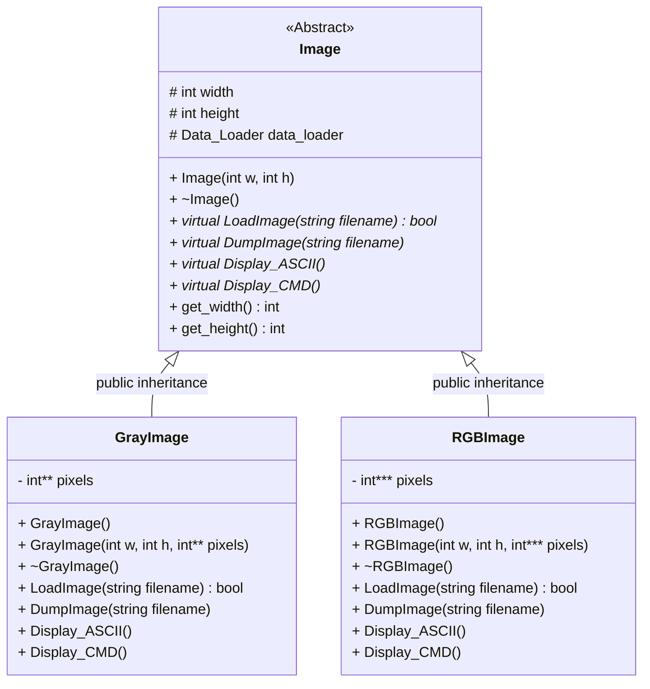

繼承詳細指示:
*    Base class: Image

        Data member:  
        *    int w(protected)
        *    int h(protected)
        *    Data_Loader data_loader(protected)
                >[!WARNING]
                >`data_loader` 要讓所有 image class 來共用，請查詢 C++ keyword: static member variable 或是設計模式中的 Singleton Pattern (單例模式)，思考如何避免重複創建 Data_Loader。

        Member function(all public):
        *    Constructor/Destructor
        *    int get_w()
        *    int get_h()
        
        <span style="color:red">Pure</span> virtual function(let derived class override, all public):
        *    bool LoadImage(string filename)
        *    void DumpImage(string filename)
        *    void Display_ASCII()
        *    void Display_CMD()

*    Derived class: GrayImage (public inheritance Image)

        Data member:  
        *    int **pixels(private)

        Member function(all public):
        *    Constructor/Destructor

        Override Base class virtual function(all public):
        *    bool LoadImage(string filename)
        *    void DumpImage(string filename)
        *    void Display_ASCII()
        *    void Display_CMD()
        
*    Derived class: RGBImage (public inheritance Image)

        Data member:  
        *    int ***pixels(private)

        Member function(all public):
        *    Constructor/Destructor

        Override Base class virtual function(all public):
        *    bool LoadImage(string filename)
        *    void DumpImage(string filename)
        *    void Display_ASCII()
        *    void Display_CMD()

Ex:
```cpp
Image *img1 = new GrayImage(100, 100, pixels_arr);
img1->LoadImage("Image-Folder/mnist/img_100.jpg");
img1->DumpImage("img1.jpg");
img1->Display_ASCII();
img1->Display_CMD();

Image *img2 = new RGBImage(100, 100, pixels_arr);
img2->LoadImage("Image-Folder/lena.jpg");
img2->DumpImage("img2.jpg");
img2->Display_ASCII();
img2->Display_CMD();

delete img1;
delete img2;
```
>[!NOTE]
> 上述程式碼中，值得注意的有三點:  
>1. `img1` 和 `img2` 都是指向 <span style="color:red">base class Image</span> 的指標  
>2. GrayImage 和 RGBImage 都是 `Image` 的 <span style="color:red">derived classes</span>  
>3. LoadImage、DumpImage、Display_ASCII 和 Display_CMD 都是在 base class Image 中宣告的 virtual functions，且在 derived classes 中被 override

>[!NOTE]
>學員需要將Step1所提到的data_loader所提供的method整合進這些class中，並且支援polymorphism中的dynamic binding(late binding/run time polymorphism)。

>[!TIP]
>實作 Display_CMD() 時，若衍生類別在記憶體內只有像素陣列而沒有實體檔案，可以考慮先呼叫 DumpImage() 產生暫存檔，用完後呼叫 system() 指令將其刪除。詳細作法可參考最下方的 Q&A 部分。

## Step 3: Bit-field with image filter design(15%)
一般圖片在做影像處理演算法時，大多會通過許多次的影像增強演算法或是降躁銳化。因此在這個部分，我們希望學員透過使用bit_field的方式，來指定要通過1~4種簡單影像處理的演算法。

*    Bit field介紹:
1. 透過 Bitwise OR (`|`) 來load不同的option
2. 透過 Bitwise AND (`&`) 來確認某個option是否有被enable
```cpp
#include <stdio.h>
#include <stdint.h>

#define CASE_ONE    0b00000001
#define CASE_TWO    0b00000010
#define CASE_THREE  0b00000100
#define CASE_FOUR   0b00001000


//using bitwise and to track whtat is the user's option
void loadCase(uint8_t option){
    if(option & CASE_ONE)
        printf("Case 1 detected\n");
    if(option & CASE_TWO)
        printf("Case 2 detected\n");
    if(option & CASE_THREE)
        printf("Case 3 detected\n");
    if(option & CASE_FOUR)
        printf("Case 4 detected\n");
    printf("\n");
    printAndResult(option);
}

int main(){
    //test1:
    uint8_t option = 0b00001001;
    printf("test1:\n");
    loadCase(option);

    //test2:
    printf("test2:\n");
    loadCase(CASE_ONE | CASE_TWO);

    //test3:
    printf("test3:\n");
    loadCase(CASE_ONE | CASE_TWO | CASE_THREE | CASE_FOUR);
    return 0;
}
```


以下列出幾個常見的影像處理演算法或是簡易的算式:

*    Box filter(用於模糊)  
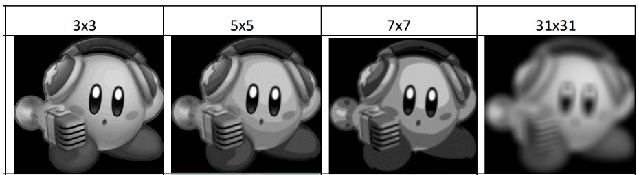

*    Sobel Gradient(萃取出垂直與水平的線條)  
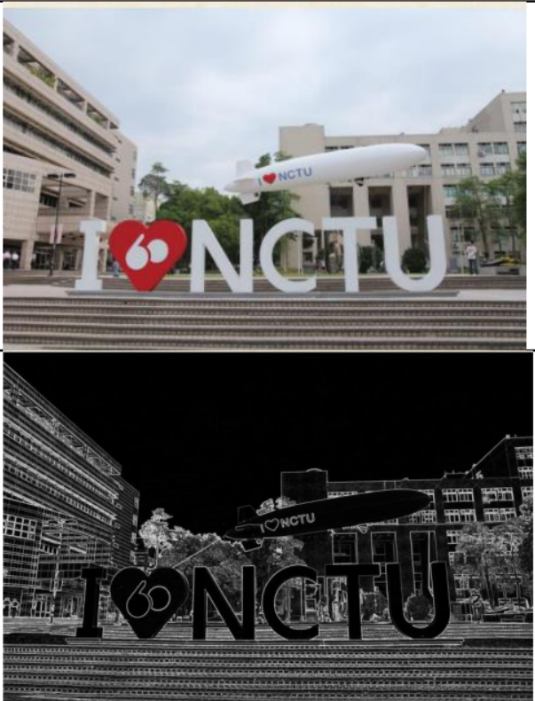

*    Contrast Stretching(影像銳化)  
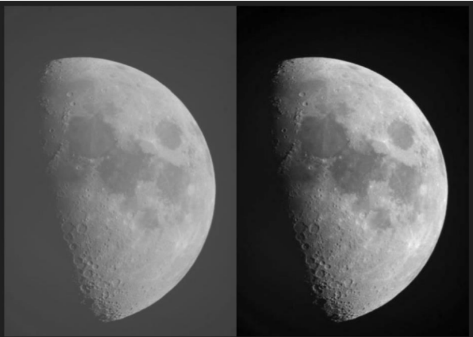

*    Mosaic filter(對照片打碼)  
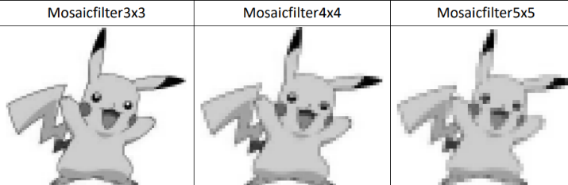


學員可以參考 [大一上計算機程式設計期末專題成果展](https://hackmd.io/@coherent17/ICP_Final_Image_Filter)


>[!NOTE]
>預期同學實作任意四種以上的圖片影像處理的演算法，並透過bit field的概念來決定要enable哪幾個演算法。

## Step 4: Photo Mosaic(15%)

透過許多張小圖來當成大圖的像素。透過RGB channel的平均值來決定大圖中某個grid要由哪個小圖來代表。我們提供了常見的dataset: cifar10, mnist，放在Image-Folder資料夾中，來給同學當成小圖，大圖同學可以自行準備，抑或是使用我們提供的放在Image-Folder內部的圖片。

預期學員撰寫一個class PhotoMosaic，並且與前面所建立好關係的Image繼承鍊及data loader整合，撰寫photo mosaic的演算法，希望提供一個函式介面，讓使用者可以將放很多小圖的資料夾路徑傳入，及大圖的路徑傳入，而後回傳一個指標指向彩圖這個物件，使得使用者可以再使用這個物件來dump/display等等。
    
*    Algorithm (3 steps)  
        1.    使用data_loader讀取target image  
        2.    使用data_loader讀取所有的小圖  
        3.    將target image進行分割並與所有小圖進行比較，挑選出rgb channel相差最少的小圖，而後將其填入回傳陣列中

>[!NOTE]
>何謂相差最小?  
>1. 對所有的小圖算出紅色/綠色/藍色channel的所有像素的平均
>2. 與大圖中partition出來的某個grid的紅色/綠色/藍色算差異平均的差異
>$$
>diff=\sqrt{r_{diff}^2+g_{diff}^2+b_{diff}^2}
>$$
>3. 選擇diff最小的小圖代表該大圖的grid
>4. [more algorithm reference & detail](https://www.geeksforgeeks.org/implementing-photomosaics/)

>[!NOTE]
>同學可以在必要的情況下，針對class image gray_image rgb_image增加operator overloading/resize/crop等method，來協助實作photo mosaic的部分。


感謝作者TA林煜睿提供照片測試:
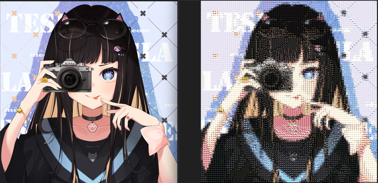

Zoom in:
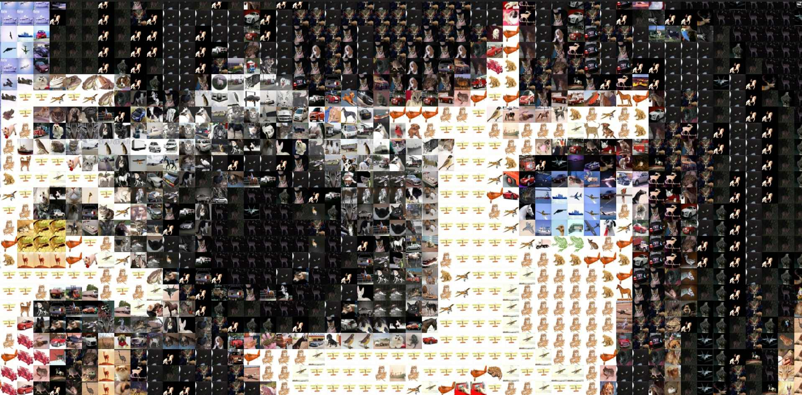

## Step5: Optional features (25%)
這個部分可做可不做，功能根據自己的興趣自由發揮。以下舉一些額外功能的例子:

*    鼓勵大家貢獻自己的程式到開源社群，上傳project到github得到2分。(需附上project repo)並且盡早建立如何做好程式專案版本控制(version control)及如何與團隊協作專案的能力。
        
        較詳細的 git/github 教學:  
        [](https://www.youtube.com/watch?v=FKXRiAiQFiY)  
        影片後半段關於分支的內容帶得比較快，可以在實作的過程中依照自己當時的需求詢問 Gemini/GPT/Claude 來有更清晰的理解
        
*    Image Segamentation(影像分割)
*    Photo Mosaic with only 1 picture [IEEE paper link](https://ieeexplore.ieee.org/document/7965140)  
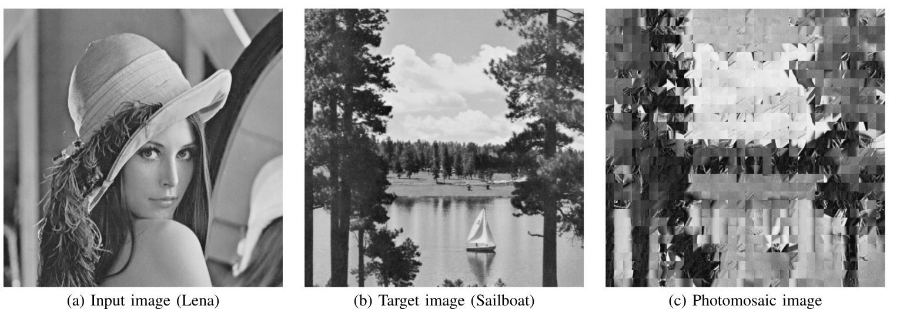
*    Parallel Algorithm Implementation(MPI/pthread/cuda): NTHU PP周志遠教授
[](https://youtu.be/t_q0Tajpyso)

*    Design Pattern: [ref link](https://refactoring.guru/design-patterns/cpp)  
        C++中的設計模式很重要，因為它們提供了解決常見問題的有效方法。在這門課中，僅有教學員簡單的OOP語法，並沒有教導學員如何撰寫出有品味，可重複使用，可維護性及可擴展性的程式碼。Design Pattern，是一種OOP程式的模板，遇到某種問題，便可以套用這些模板來使用，來減少錯誤的發生並且提高程式的重用性、可擴展性和可維護性，並且有助於團隊間的溝通和遵循最佳實踐。

>[!NOTE]
>以上只是幾個加分題的方向舉例，同學不需要侷限在這些題目中，可以自行發想有趣的題目。

## Driven Code for Step1~4 and Optional Step5
希望學員能夠設計一個清晰且優雅的使用者流程讓上面Step1~4與您所設計的Step5(如果有)都可以被demo到。若是單一一個main.cpp不夠您demo所有的功能，您可以自行設計其他driven code的檔案，並且更改`Makefile`中相關編譯的dependency與方法。

    
## Project Setup
```bash
$ git clone https://github.com/gqu3rb/1142-NYCU-OOP-Final-Project.git
$ cd 1142-NYCU-OOP-Final-Project

# install the third party package
$ make install

# start programing your final project
# finish *.h in inc/ & *.cpp in src & main.cpp

# compile
$ make               # default
$ make VERBOSE=1     # check out what make actually do
$ make -j            # compile in parallel (save time, suggest)

# run your program
$ ./Image_Processing

# Dynamic memory check
$ make check
```
## Project Structure

```bash
$ tree -L 2
```
```
.
├── Data-Loader (處理image I/O)
│   ├── data_loader.cpp
│   └── data_loader.h
├── Image-Folder (放圖片的地方)
│   ├── 4k_owl.jpg
│   ├── cifar10
│   ├── girl_2x.png
│   ├── lena.jpg
│   └── mnist
├── LICENSE
├── Makefile
├── README.md
├── README_images
│   ├── ascii_art.png
│   ├── blur.png
│   ├── cppcheck_error.png
│   ├── display_cmd.png
│   ├── grayscale.png
│   ├── jpeg_make_error.png
│   ├── miao.png
│   ├── minst.png
│   ├── mosaic.png
│   ├── photo_mosaic.png
│   ├── photo_mosaic_single_img.png
│   ├── photo_mosaic_zoomin.jpg
│   ├── rgb.png
│   ├── sharp.png
│   ├── vh_line.png
│   └── without_static_error.png
├── data_loader_demo.cpp (示範如何使用data_loader Step1)
├── inc (put your header here)
│   ├── bit_field_filter.h (Step3)
│   ├── gray_image.h (Step2)
│   ├── image.h (Step2)
│   ├── photo_mosaic.h (Step4)
│   └── rgb_image.h (Step2)
├── main.cpp (Driven Code)
├── scripts
│   └── clone_env.sh
├── src (put your implementation here)
│   ├── bit_field_filter.cpp (Step3)
│   ├── gray_image.cpp (Step2)
│   ├── image.cpp (Step2)
│   ├── photo_mosaic.cpp (Step4)
│   └── rgb_image.cpp (Step2)
└── third-party (第三方開源圖片套件)
    ├── CImg
    ├── catimg
    └── libjpeg
```

將class header interface放在inc folder內部，並且將source code的實作放在src folder內部，makefile會自動去識別dependency，並且在您對某些檔案進行修改後，僅編譯需要重新編譯之檔案，不會整份project重新編譯一次，如此一來再搭配上parallel compile，讓您再開發上能夠節省不少時間。

## Grading Policy
*    Step1~Step4(15% * 4 = 60%) 需要將結果秀在書面報告中

>[!CAUTION]
>請將QA及書面報告整理在一份pdf報告中!
*    QA(6%)
        *    Q1:請大致解釋 `make install`做了甚麼事情。
        *    Q2:makefile是如何協助編譯這份project的?(從inc/ src/回答)
        *    Q3:請解釋在Step3中如何設計bit field演算法，如何決定要使用多少bit，這樣做有甚麼優點?
        *    Q4:在Step4中，你如何處理邊界問題?(若大圖的長寬不是小圖的倍數，你會怎麼處理?)
        *    Q5:在Step4中，如果每張小圖的大小都不一樣，你會怎麼處理?
        *    Q6:使用valgrind及cppcheck來對你的程式做動態分析與靜態分析，並秀出執行結果與報告。並解釋這兩種分析有何不同?(try to install cppcheck by your self...)

*    書面報告(9%)
        *    Step1~Step4 及 Step5(如果有) 結果圖
        *    解釋整份project中哪邊使用了繼承與多型，對於Step3&4及你的加分題是如何與其他的class互動的?eg: friend class, another inheritance?請使用類似Step2那張class之間的關係圖清楚的表示。
        *    分享你在這份project中遇到了甚麼困難，又是如何解決的?
        *    心得與回饋

*    Step5 (25%) 根據自己的興趣，自由發揮創意延伸，並請記得將結果圖放在報告中
(e.g. 上傳此 project 到 Github 需要附上您的 repository 網址)

## Submission
*    Time: 2026/6/18(四) 12:00
*    File to submit: `1142-NYCU-OOP-Final-Project.tar` & `final_report.pdf`
        ```bash=
        # 產生壓縮檔
        $ ls # 確認已跳到1142-NYCU-OOP-Final-Project外面
        $ tar cvf 1142-NYCU-OOP-Final-Project.tar 1142-NYCU-OOP-Final-Project/
        $ ls # 確認1142-NYCU-OOP-Final-Project.tar已經產生 -> submit to e3

        # 解壓縮
        $ tar xvf 1142-NYCU-OOP-Final-Project.tar
        ```
>[!WARNING]
>請確認解壓縮後，可以在linux上成功編譯並且執行。

## Demo
*    Time: 2026/6/18(四) 14:00~16:00
*    Place: Online

>[!NOTE]
>在Linux中運行程式，詳細的呈現每一項功能，沒有demo的組別期末專題0分

>[!CAUTION]
>抄襲0分

## Thanks for the following open source projects
*   CImg (https://github.com/GreycLab/CImg)
*   libjpeg (https://github.com/kornelski/libjpeg)
*   catimg (https://github.com/posva/catimg)

## Q&A

學會如何問問題:  
[](https://youtu.be/Ro6zXK1DYGc)  

在之前期末專題寫信來問問題時，蠻多人都不知道如何問一個好的問題。剛好今天yt演算法推薦上面這部影片給我就拿來跟你們分享。

希望你們在問問題時，可以讓我們知道你的具體情況、想要做什麼，並且提供相關的證據(截圖或是error message)。  

---

這些是先前學員們提出過的問題，提供給各位參考:

*    Q1:  
        有些圖片為何經過data_loader讀取後會發生錯誤?

*    A1:  
        有些圖片除了R、G、B三個通道外，還會帶有第四個代表透明度的alpha通道，由於先前Data_Loader中Load_RGB所定義的pixels為三通道，因此讀取後會產生錯誤。這種問題會出現在某些png圖片中而不可能發生於jpg圖片，因為png才會有透明屬性，jpg則無。
        
        因此我們修改Data_Loader中Load_RGB，首先創建Dynamic Array時直接限制為三通道(不再根據_c創建對應大小的陣列，因為_c有可能為4)，並限制其只填寫前三個通道的數值至pixels中(即不填寫alpha通道的數值)。同理，Load_Gray我們也做了相應的處理。
        
        所以最後同學透過Data_Loader Load_RGB與Load_Gray所讀取的結果將不再帶有alpha屬性，只要當作正常三通道(RGB)或是單通道(灰階)的圖片進行操作即可。
        
        相關資料同學可以參閱此網站: https://reurl.cc/OMmpRD

*    Q2:  
        GrayImage 和 RGBImage class 中的CMD要呼叫datal_loader裡的Diaplay_Gray_CMD、Display_RGB_CMD function，但我們不知道filename要去哪裡抓，請助教們解惑。
*    A2:  
        這邊其實有點tricky,算是我想要考你們的其中一個點：中間檔案的產出。

        有時候在程式執行中，不免會產生一些中間的檔案，可能是log(程式執行上的一些紀錄），抑或是其他程式或是function會需要吃的特定format 的output file 。

        這邊我有提示需要搭配dump 來使用，可以先產生一個暫時的輸出圖片，使用CMD相關function之後（內部實作其實是去call catimg 的binary 執行檔），再使用system call的方法將該暫時出現的圖片刪除。查詢C/C++ system()的使用方式，配搭之前之前上機課教過的linux command 即可在c++中刪除該中間產生的圖片檔！
        
*    Q3:  
        可以在Image.h gray_image.h rgb_image.h中加額外的member function或data member嗎?
*    A3:  
        可以喔! 記得註明在報告中!

*    Q4:  
        原本 Step 3: Bit-field with image filter design(15%) 是使用bit_field的方式，來指定要通過1-4種簡單影像處理的演算法，那如果我多做幾個bit_field，做到7-8個這樣，這樣能算進額外功能的部分嗎?  
*    A4:  
        可以，我們會將功能複雜程度分成 A B C D不同等級，依次分別加 7 5 3 1的分數！記得在報告描述你做了什麼功能及實作細節！

*    Q5:  
        助教您好，關於make後執行編譯檔時顯示 Failed to recognize format of file 'Image-Folder/1.jpeg’.，也試過jpg檔和png檔，都出現同樣的問題，有用過file Image-Folder/1.jpeg測試檢查文件格式，出現JPEG image data ，所以應該是沒問題的。因此想詢問為何出現此錯誤呢？
*    A5:  
        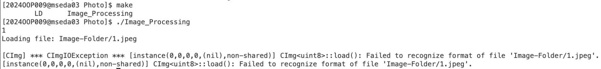  
        這邊確實蠻複雜的，當初我在串Cimg library 的時候也卡了很久，跌了很多的坑，因此我提供了data_loader的class 讓你們免於這些困擾，你可以很簡易的使用data_loader 所提供的介面來把圖片讀成陣列！不需要自己去撰寫讀檔的部分！
        
*    Q6:  
        想請問QA中提到的cppcheck要如何安裝呢?雖然網路上有很多參考資料但我還是搞不定。
*    A6:  
        這邊是期許同學有能力自行抓取網路上的open source project到local端自己compile。
        cppcheck的程式是開源，且網路上找得到的。  
        可以從網路上抓下壓縮檔，到我們的server解壓縮再編譯，而後得到cppcheck的binary executable。
        
        ```bash
        $ wget https://github.com/danmar/cppcheck/archive/2.13.0.tar.gz    # 下載cppcheck整包的壓縮檔
        $ tar xvf 2.13.0.tar.gz                                            # 解壓縮
        $ cd cppcheck-2.13.0/                                                                       
        $ make -j                                                          # compile [要等一陣子]

        # cppcheck usage
        # <checkFile> : path for file or directory
        $ ./cppcheck <checkFilePath> --enable=all --inconclusive --suppress=missingIncludeSystem # 後面參數你可以自由決定
        ```
        給你一個例子看看: test.cpp
        ```cpp
        #include <iostream>

        using namespace std;

        int main(){
                int a[10];
                a[10] = 0;
                a[9] = 1;

                if(a[9] == 1){
                        cout << "hi";
                }
        }
        ```
        執行結果:  
        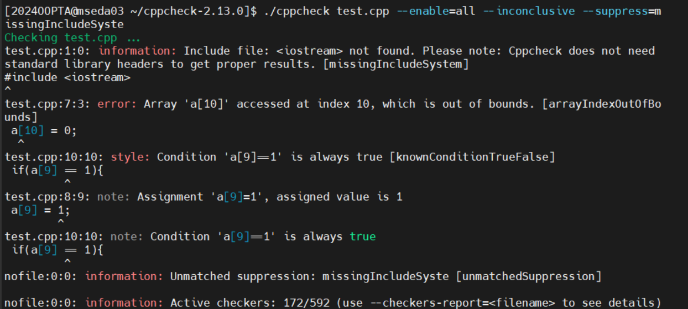
        可以看到這支程式中很明顯犯的錯誤，此為靜態分析。在沒有執行你的code的情況下，將我們的code當成cppcheck這支程式的input，來做code的錯誤偵測。
        
*    Q7:  
        這邊還想請問一下cppcheck應該要安裝在我的資料夾中的哪一層呢?因為我剛才用發現貌似被測試的檔案必須要在cppcheck-2.13.0的資料夾中才有辦法成功被檢測。是否我還需要將要檢測的程式碼複製一分到cppcheck-2.13.0當中?
*    A7:  
        因為cppcheck executable 是有depends於一些檔案，因此單純搬運cppcheck binary executable 是行不通的

        你不一定要安裝在我們專題資料夾中，你可以把./cpocheck [這邊放專題路徑] —some argu 

*    Q8:  
        在檢查main.cpp時，他會報說:
        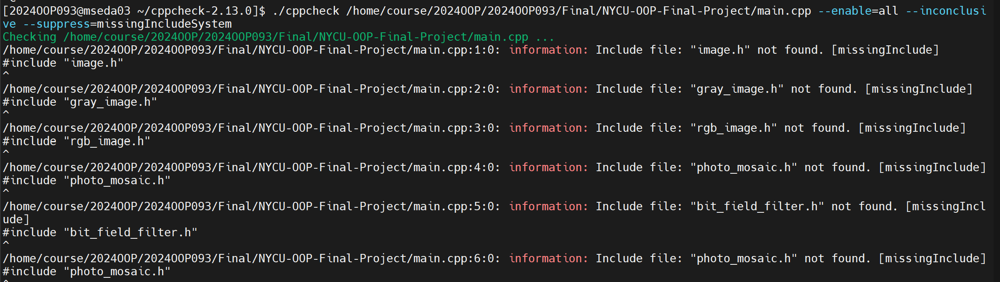  
        請問要這樣直接放進報告中嗎?還是要將其他所有的cpp檔都用cppcheck跑過一次?
*    A8:  
        不過cppcheck 是可以recursive check 某個目錄底下的所有code 檔案，請將路徑改為我們專題的根目錄，並且將third-party 中的code exclude 掉，便可以偵測該project 中所有的code!

        你可以先找cppcheck argument 來exclude 特定third-party 中的程式，或者你直接把third-party 全刪，跑完cppcheck 再make install 回來。

        你也可以將cppcheck 的功能加入makefile 中，使你只需要打make cppcheck 便可以檢查到所有相關的檔案，不需要每次都打那麼長的指令！
        
        此外，你也可以在報告中提及cppcheck 偵測了什麼樣的warning 及error 出來，而後你又是如何解決的！

        這些tool:cppcheck 及valgrind 都是常見的錯誤偵測的程式，在外面工作之後，當你的code 要整合進公司code base 前都會需要先經過這些檢測！在大一提早教你們這些tool 的使用讓你們可以及早熟悉！

## Some Feedback from the Previous TA
*    OOP終究只是一種程式設計的風格

        使用OOP並不會讓你的程式跑得比較快，OOP僅僅是一種程式設計的風格，若是對程式有興趣的同學可以在未來修習資料結構及演算法。資料結構會教你如何存資料，使得你對資料的存取可以有更有效率的方法。演算法是一種解決問題的方式，不同的演算法有不同的複雜度。選擇一個好的演算法及搭配適合的資料結構才是使各位程式跑的更有效率的不二法門!
        

*    Programming + Domain Knowledge

        我想大一的各位應該都尚未學過影像處理的演算法對吧!在大家只有基本程式能力的情況下，讓大家上網自學影像處理演算法，辛苦大家了。我想各位都來自不同的領域，在各自領域學有所成後，將程式設計結合進各位的相關領域，各位便可以有著無限的潛能!大家未來加油!

*    Model Synthesis

        其實這次很期待各位可以將AI方面的演算法甚至是機器學習演算法整合進我們的程式中。對於圖片來說最常見的機器學習演算法為CNN架構，說白了就只是做權重的乘與加而已，其實數學是非常簡單的。實際實現可以先使用python的框架(tensorflow/pytorch)去訓練一個機器學習模型，而後將訓練出來的權重存成陣列(array in c/c++ code)，那同樣也可以在c/c++ code中運行ML algorithm。目前也有相當多的開源套件在這方面發展，可以很輕易的將ML model 嵌入在我們的c/c++ code中，給各為一個新奇的想法!

*    Tool的使用

        這次的final project要求各位去學著使用git/make/valgrind/cppcheck，確實對各位負擔比較大，但是我想這只都只有帶各位入門而已，未來各位在開發程式的時候，記得善用各種工具來輔助，來增加效率。這些tool到各位出社會前都不會有專門的一堂課來教你這些tool如何使用，希望在大一及早帶各位閱覽這些tool有助於各位未來的發展!

*    行銷的重要性
        
        這次很多同學都實作了非常多的功能，但是不管是報告，或是如何使用你們的程式都是草草帶過。對我來說，程式寫得好與撰寫完整的技術文件與使用方式是相同重要的。

*    一些不錯的連結
        
        *    [你所不知道的c語言](https://hackmd.io/@sysprog/c-prog/%2F%40sysprog%2Fc-programming)
        
                這個網站由成大資工教授jserv維護，希望各位暑假有空可以點進去學習更多程式相關的基礎知識!
                
        *    [Jacob Sorber](https://www.youtube.com/@JacobSorber)
                
                一個很好入門資料結構的youtuber課程

        